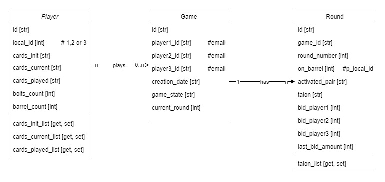
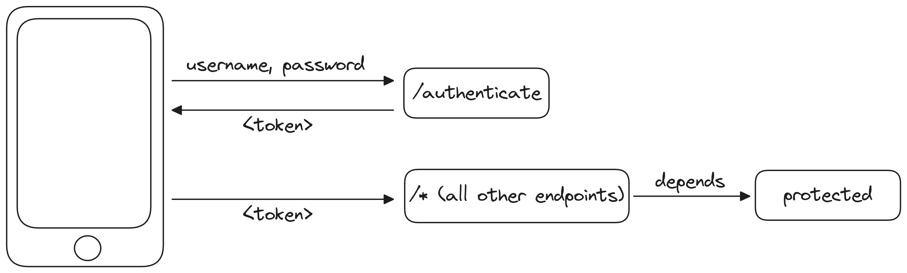

# api-thousand-game
An API Repository for Thousand Card mobile game.

## Quick Run
1. Clone the repository locally
   ```
   git clone git@github.com:farid002/api-thousand-game.git
   ```
2. Change directory to api-thousand-game, create virtual environment and activate it
   ```
   cd api-thousand-game
   python -m venv venv
   venv\Scripts\activate
   ```
3. Install needed packages
   ```
   pip install -r requirements.txt
   ```
4. Activate pre-commit **(IMPORTANT!)**
   ```
   pre-commit install
   ```
5. Run main.py and navigate to http://localhost:5000/docs


## Database
We use SQLAlchemy (ORM) with Sqlite DB.
Class Diagram of the API has been illustrated below.


**DID YOU MODIFY ANYTHING RELATED DATABASE?**
 - Follow the instructions on "Additional" section!

## JWT Authentication

- We use PyJWT for authentication with signed key method in accordance with RFC 7519 (JSON Web Token standard).



+ [FastAPI OAuth2](https://fastapi.tiangolo.com/advanced/security/oauth2-scopes/)
+ [JWT Authentication](https://jwt.io/)
+ [RFC 7519](https://datatracker.ietf.org/doc/html/rfc7519)

## Docker setup
- Follow the Docker installation (for WSL) as in https://dataedo.com/docs/installing-docker-on-windows-via-wsl
- or for Ubuntu: https://docs.docker.com/engine/install/ubuntu/
- Install Docker Compose as in https://www.digitalocean.com/community/tutorials/how-to-install-and-use-docker-compose-on-ubuntu-22-04 
- 
- Run `docker compose up -d --build`
- 
- OR:
- Build Docker Image: 
   ```
   docker build -t thousandapi .
   ```
- Run container with the built Image: 
   ```
   docker run -d --name thousandapi_container -p 5001:5001 thousandapi
   ```
- (additional) Get IP Address with: ```ip addr show eth0 | grep inet```
## Contribution
- Don't forget to activate pre-commit locally (as stated on Setup steps)
- Follow correct naming conventions, especially PEP8 standards. Check further on: https://peps.python.org/pep-0008/
- Create branch with a special pattern: **<issue_type>/<github_issue_no>/<short_desc>**. Issue type can only be: feature, bugfix or other. Sample branch name: **feature/2/get_talon_function**
- After branch is ready to merge with develop branch, please create a Pull Request (PR) and assign Farid Huseynov as a reviewer.

## Additional
### How to generate ER Diagram
 - Download and install Graphviz 64bit exe for Windows from https://www.graphviz.org/download/ 
 - Then: pip download pygraphviz
 - extract it
 - cd pygraphviz-1.13
 - python setup.py build_ext --include-dirs="C:\Program Files\Graphviz\include" --library-dirs="C:\Program Files\Graphviz\lib"
 - python setup.py install
 - done!


 - install eralchemy: pip install eralchemy2
 - generate UML: eralchemy2 -i sqlite:///games.db -o er-diagram.jpg