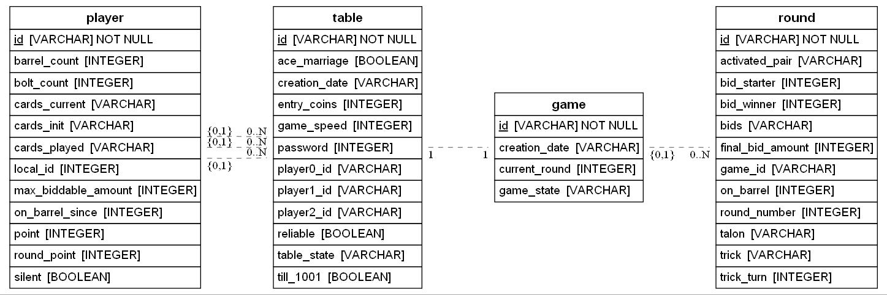

# api-thousand-game
An API Repository for Thousand Card mobile game.

## Quick Run
1. Clone the repository locally
   ```
   git clone git@github.com:farid002/api-thousand-game.git
   ```
2. Change directory to api-thousand-game, create virtual environment and activate it
   ```
   cd api-thousand-game
   python -m venv venv
   venv\Scripts\activate
   ```
3. Install needed packages
   ```
   pip install -r requirements.txt
   ```
4. Activate pre-commit **(IMPORTANT!)**
   ```
   pre-commit install
   ```
5. Run main.py and navigate to http://localhost:5000/docs


## Database
We use SQLAlchemy (ORM) with Sqlite DB.
Class Diagram of the API has been illustrated below.


**DID YOU MODIFY ANYTHING RELATED DATABASE?**
 - Update the **.drawio** file under **/assets** folder on https://app.diagrams.net/ accordingly
 - Export as JPG with 20 margin and replace the /assets/er-diagram.jpg 
